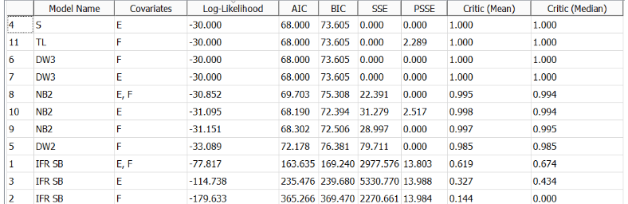
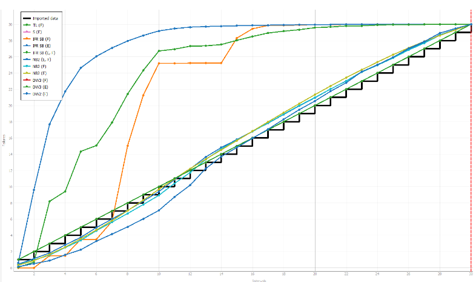
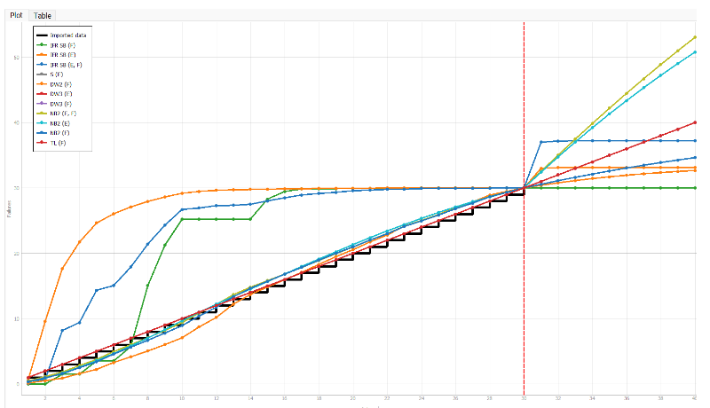
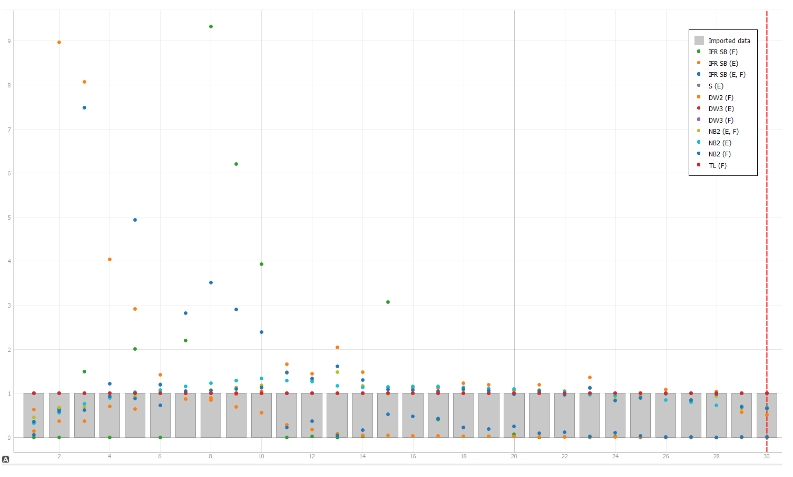
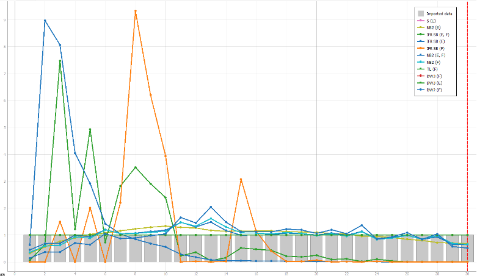
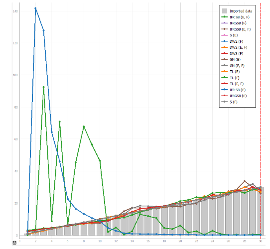
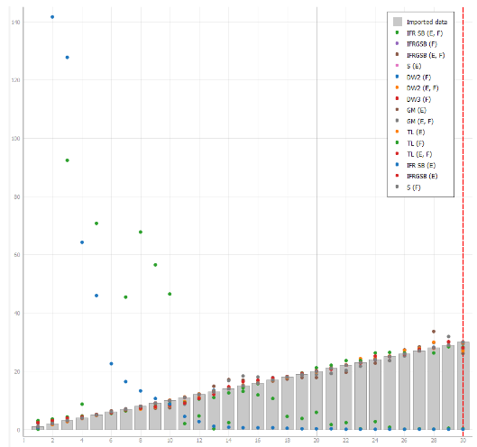
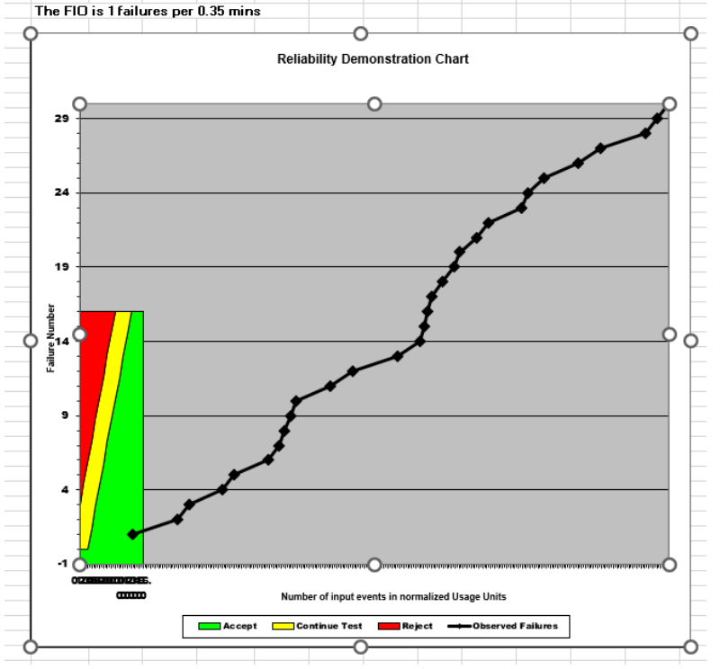
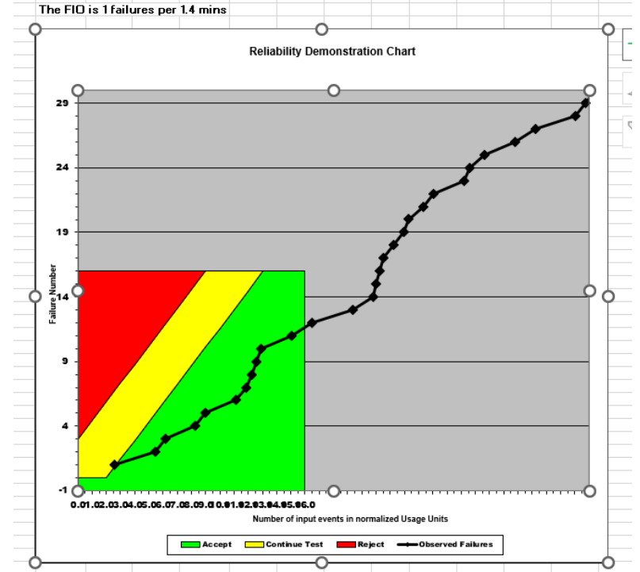

**SENG 438- Software Testing, Reliability, and Quality**

**Lab. Report \#5 – Software Reliability Assessment**

| Group \#:       | 23  |
|-----------------|---|
| Student Names:  | Mustafa Muhammad  |
|                 | Samuel Tomocek  |
|                 | Umair Tariq |
|                 | Gian Luke Adug |

# Introduction

# 

# Assessment Using Reliability Growth Testing 

These were our results using Failure Report #9, which dictated a simple failure report through failure numbers, time since and between failures (i.e. previous failures), cumulative execution time, and the severity class. We know that the severity class is linked to the failure intensity and a low severity class is associated with a lower failure count often. As such we modified our data to align with the FC count as being mostly stable within this data. Then we examined the (F) which was the time since the previous failure and measured the identification work of the failure in hours. Then the (E) which was the cumulative execution time and converted them from minutes to seconds. This gave us the data we needed to create models and compare them using C-SFRAT. Within this application we are given several parameters that dictate the best model. What we found that demonstrates this is Log-Likelihood, AIC, and BIC. Higher Log-Likelihood are associated with better data fits for the models and as such you can see that S and TL are among the two best models and also have the best AIC (lower AIC gives us better model fits). However, NB2 and S gave the two best BIC values and this outlines S to be the most superior model in our case however, TL is still a better model fit than NB2 due to better log-likelihoods and AIC values. Thus our top two models will be S and TL (S Distribution and Truncated Logistic).

**Result of range analysis (an explanation of which part of data is good for proceeding with the analysis):**

Overall we get a various range of analysis for the models in their specified covariates. The worst part of the data would be near the middle to end, as the IFR SB model graphs tend to start spiking in failures quite early and as a result with a short amount of intervals they begin witnessing more and more failures in an exponential manner. DW2 shows initial failures to be lower but gradually increase more than our best models which are S and TL. Overall in terms of failure consistency, S and TL demonstrated to be the most consistent, quite similar to a linear progression of failures where we know when these failures likely occur. Therefore the earlier parts of the data demonstrate lower failures obviously but specific models dictate where they tend to spike. It also should be noted we have 30 failures in total to work with, which may pose a limitation of the failure report paper as more failures would give us better data to work with. If we had to predict the model we see that some models still persist in the mean value function whereas S and TL remain consistent with their previous indicated trends and consistently predict the same mean value. The trend could potentially be formulated better using the laplace test but for the purposes of this assignment and to demonstrate trends through the use of the program C-SFRAT we have chosen to show the trends as they are through the predictions of the models provided.

**Plots for failure rate and reliability of the SUT for the test data provided**

As seen by the intensity graph, the failure intensity is often seen in increasing and decreasing patterns, with IFR SB, primarily the intensity spikes and is unreliable many times but the reliability does smoothen out after approximately 18 intervals. Nearly all the other models dictate values at 2 or lower demonstrating that there is stable reliability. S and TL are fully stable at the severity of 1 and are not as variable as the others. Within the failure report we witnessed a severity failure of 1 across the board. Specifically for  failure report #9, and the consistent failure severity class of 1 is unique to the paper. How this reflects upon the data is that the program itself does not have many failures occasionally coming and is for the most part a predictable program with occasional variabilities. If we were to use the models for prediction then we can see which models dictate the outcomes in different ways. We can see that NB2 is the only model that predicts that the intensity will persist but occasionally lessen in severity whereas the other models predict a spike which will later subside until the program is complete. What this means for the reliability of the SUT is that it may become unreliable during longer periods of time but could also see much lower reliability the longer the program goes on.

If failure intensity was calculated in an incremental manner, that is the failure count was consistently increasing as the severity is 1 through every test case, and as such we would have that incremental pattern of going up by 1 for the failure count as well. This is another approach to visualizing the data and if done this way we can notice IFR is still the model that provides us with outliers in the trend and overall dictates that the system is still facing the most failures under the early stages and the intensity of the failures is most prevalent there. Looking back at the results of the model we also know IFR does not have the best log-likelihood and as such it does not determine the best fit of or goodness of the best fit in the best manner. Therefore, we know what points are erratic for our graph and the failure intensity is best calculated as increasing while going up.

We can also predict the trend of the failure intensity and see that the intensity may stay consistent and still occasionally spike but it will eventually start to ease out from that moment as the failure intensity target reaches 1 through simulation. This is what the model predicts for us. What this means for the reliability of the SUT is that it may become unreliable during longer periods of time but could also see much lower reliability the longer the program goes on because the overall stability in the program according to the failure report is quite inconsistent overall despite having a severity class of 1 across the board and unforeseen reliability issues may still persist.

**A discussion on decision making given a target failure rate:**

When we’re looking at software reliability testing, we need to understand that to evaluate the reliability and performance issues present within various applications and programs we need to use a determination factor and once an excellent determination factor is the given target failure rate. However before explaining this topic it should be noted that failure report #9 had a severity case of 1 consistently and overall this skews the given target failure rate in a way which makes it difficult to fully predict and make accurate decisions as the system has not been stress tested enough to determine the most applicable and fully robust model possible to determine such an outlier case. From the given failure report we can also make decisions based on the time between failures. The target failure rate is used in conjunction with the model variables to allow us to predict what the failure persistence and trend would look like and transition towards. Therefore the failure data from paper #9 is fitted to the model and as a result we are given many tidbits of the overall failure rate data such as log-likelihood, AIC, BIC and these allow us to further examine the trends and make better decisions. Then analyzing the mean value function gives us a deterministic approach to absolving the system of incompetence through the best models but the worst models still provide stingy results and as such we are given further information of things we should be looking out for, such as sporadic outbursts in the program (albeit here, very unlikely) but can still occur; however, given that the model predicts this to be a very very low outcome then we can conclude that the given target failure rate provides us with confidence in stating that the system is reliable under these situations and the data backs this up by showing the severity of 1 consistently. In our model, once we used the intensity graph metrics to determine when the target failure rate reached its expected form, we could also visualize, analyze, and predict the outcome of the system under various stress tests and how it may function and perform under those conditions. The data ultimately lets us visualize this by giving predictions from the various models and allows us to see if our current failure report is acceptable for the standards we need to reach to determine whether or not we can make a good decision on sending a software for approved reliability through all the reliability growth testing measures and deduction of the target failure rate. Specifically for our program, we would see the system may become more stable through longer iterations of testing but is still susceptible to failures that may come or proceed unknowingly at the user’s expense, therefore with all the information we have been given a very in depth and precise amount of information to determine whether or not we want to approve a certain system. It should be noted that the prediction is not perfect and our decision making should still be done without using it as a definitive answer but to also induce our own judgment about the overall system through every stage of reliability growth testing we examine.  

**A discussion on the advantages and disadvantages of reliability growth analysis **

# Assessment Using Reliability Demonstration Chart 

MTTFmin

MTTFmin*2

MTTFmin/2

**Explain your evaluation and justification of how you decide the MTTFmin**

To determine a suitable value for the MTTFmin, we considered both statistical analysis and practical experience in reliability engineering. We first calculated the mean and median MTTF values from our dataset of failure times (Failure Report 9.docx). The mean MTTF value was 1.75 minutes per failure, while the median was 1 minute per failure. We then consulted the class slides and referred back to our previous knowledge of statistics to identify a good rule of thumb for defining MTTFmin value. Based on this, we decided to use a range of 30-50% of the MTTF mean value as a guideline. Using this guideline, we decided to choose a value near the middle of the range and selected a MTTF min value of 40% of the MTTF mean value, which came out to be 0.7 minutes per failure. This choice was based on the idea that a MTTFmin value within this range would allow us to sufficiently capture the failure characteristics of the system, while still being practical to use in reliability analysis. Overall, we believe that this approach represents a balanced consideration of statistical analysis and practical experience in selecting a suitable MTTFmin value for our dataset. 

**A discussion on the advantages and disadvantages of RDC**

The Reliability Demonstration Chart (RDC) is a useful tool to assess the reliability of a product or system. Its advantages include clear and concise presentation of a lot of information that can help engineers compare different products or systems and identify potential failure modes. However, RDCs can be time-consuming and require substantial data, which may not be practical in some cases. Furthermore, RDCs are limited by specific test conditions and may not provide a comprehensive picture of a product or system's reliability in real-world use. Therefore, while RDCs are valuable in reliability engineering, they should be used in conjunction with other methods for a comprehensive evaluation of a product or system's reliability.

# Comparison of Results

# Discussion on Similarity and Differences of the Two Techniques

First of all, both methods RDC and RGT are that the goal of both methods is to assess the reliability of a system through the use of statistical analysis. Both are used to help identify if there is a reliability issue that is outside of what the user deems acceptable. While both are used to assess reliability, RDC is a single graph that demonstrates if the system meets the set reliability standards using some set inputs, such as MTTF, RGT helps the developer measure the reliability rate and MTTF by analyzing the data. RGT uses multiple graphs and analysis methods, while RDC only has one output.

# How the team work/effort was divided and managed

# 

# Difficulties encountered, challenges overcome, and lessons learned

The team faced a challenge with limited functionality of the RDC software, which only allowed the use of the first 16 data points for plotting reliability demo charts. However, they overcame this challenge by adapting their approach. Overall, the project provided valuable lessons on using reliability growth testing and RDC software, improving communication, collaboration, and project management skills.

# Comments/feedback on the lab itself

The lab was well-organized and easy to follow with clear and concise instructions. The materials provided were well-prepared, engaging, and challenging, encouraging critical thinking, problem-solving, collaboration, and teamwork. The lab objectives were well-defined, and the activities provided timely feedback, allowing students to understand their progress and reinforce their learning process. Overall, the lab provided an excellent opportunity to apply theoretical concepts to practical situations, while also being enjoyable and providing a positive experience for the students.

